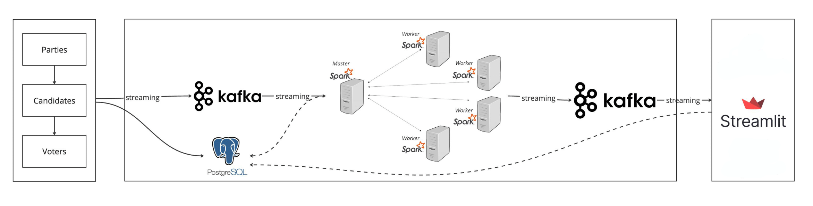

# Voter

A scalable realtime election-style voting system make with Python, Kafka, Spark, Postgres, and Streamlit.

Made to learn more about data engineering technologies like Kafka and Spark.

## System Architecture


## Demo


## How to run

1. Clone repo and setup
```bash
git clone https://github.com/yhaooo11/voter.git

mkdir checkpoints checkpoints/checkpoint1 checkpoints/checkpoint2 checkpoints/checkpoint3
```
2. Start containers
```bash
docker-compose up -d
```
3. Start Python virtual env
```bash
python3 -m venv venv 
source venv/bin/activate 
```
4. Install packages
```bash
pip install -r requirements.txt
```

5. Create Postgres tables and randomly generate candidates/voter info.
```bash
python main.py
```

6. Randomly generate votes and produce them to Kafka topic
```bash
python voting.py
```

7. Consume vote data from Kafka topic and process data with Spark
```bash
python spark.py
```

8. Run Streamlit app
```bash
streamlit run streamlist-app.py
```